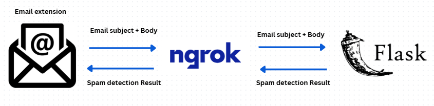
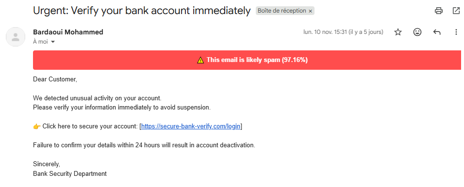
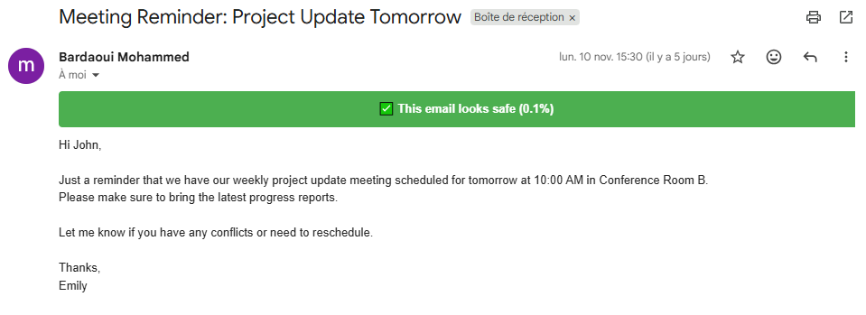
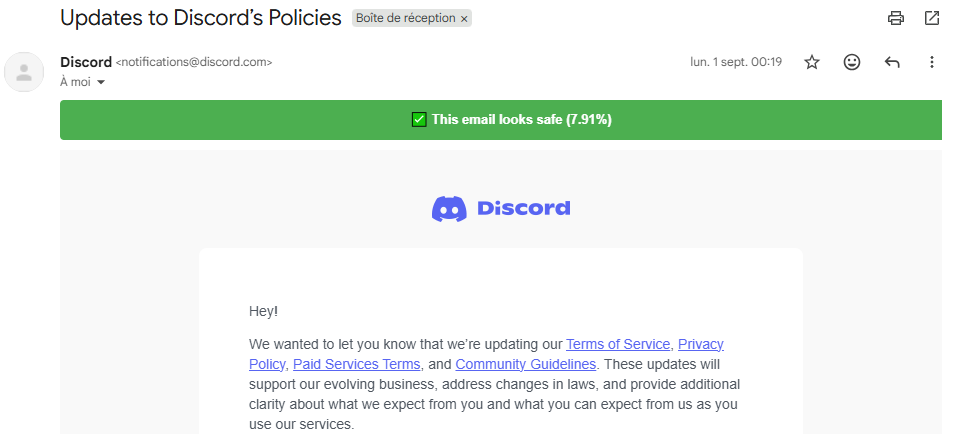

# Email Spam Detection Chrome Extension

## Project Overview
This project implements an **Email Spam Detection system** using **Machine Learning** and **Natural Language Processing (NLP)** techniques, packaged as a **Chrome Extension**. The goal is to automatically detect and classify spam emails to enhance user email experience.

The project consists of two main parts:  
1. **Machine Learning Model** – analyzes email content and predicts whether it is spam or not.  
2. **Chrome Extension** – interacts with the backend model to provide real-time spam detection in the browser.  

---

## Features
- Detect spam emails with high accuracy using **Naive Bayes** classifier.
- Use **TF-IDF vectorization** to process and convert email text into numeric features.
- Lightweight **Flask backend** deployed using **ngrok** for public URL access.
- Easy integration with Chrome via a content script.
  

---

## Backend (Flask + Ngrok)
The backend is built using **Flask**, which serves the trained model and handles API requests from the Chrome extension.  

**Ngrok** is used to expose the Flask server to the internet. It provides a secure tunnel to your local server and generates a public URL.  
- Ngrok: [ngrok](https://ngrok.com/)  
- Users must create an account to get a token.  
- The token should be placed in `flask_app/.env` or directly in the backend app configuration.  
- Copy the generated public URL (API link) into `content.js` in the Chrome extension folder.

---

## Model
- **Vectorization:** TF-IDF (Term Frequency-Inverse Document Frequency)  
- **Classifier:** Naive Bayes  
- **Utilities:** Preprocessing functions are implemented in `preprocessing_utils.py`.
- The model was trained on the Enron Spam dataset from Hugging Face:[Enron Spam Dataset](https://huggingface.co/datasets/SetFit/enron_spam)
- The trained model is saved inside the `model/` folder, which contains its own README for details.

---

## Project Structure

    📂 email-spam-extension-project
    │
    ├── 📂 extension/
    │   ├── manifest.json
    │   └── content.js
    │   └── 📂 icons/
    │        └── icon.png
    │   
    ├── 📂 flask_app/
    │   ├── app.py
    │   ├── preprocessing_utils.py
    │   └── 📂 model/
    │        └── README.md
    │  
    ├── 📓 notebook/
    │   └── spam_detection_model.ipynb  
    | 
    ├── 📂 images/
    │   ├── pipeline.png      
    │   ├── result1.png       
    │   └── result2.png 
    │
    ├──  requirements.txt
    ├──  README.md

---

## Project Structure

- `flask_app/` → Contains Flask backend, preprocessing utilities, and the model.  
- `manifest/` → Chrome extension files including `content.js`, `manifest.json`, and icons.  
- `notebook/` → Contains exploratory data analysis and model training notebook.  
- `requirements.txt` → Python dependencies.

---

## Installation & Setup

1. **Clone the repository**
```bash
git clone https://github.com/MohammedBardaoui/Email-Spam-Detection-with-NLP-Machine-Learning-Chrome-Extension-Flask-API-.git
cd project_root
```

2. **Install dependencies**
```bash
pip install -r requirements.txt
```

3. **Setup Ngrok**
   - Sign up at [ngrok] (https://ngrok.com/)  
   - Get your token and add it to the backend configuration.  
   - Start Flask and expose it using ngrok:
```bash
python flask_app/app.py
ngrok http 5000
```
   - Copy the generated ngrok URL and paste it into the API_URL constant in content.js.

4. **Load Chrome Extension**
   - Open Chrome → Extensions → Load unpacked  
   - Select the `manifest/` folder.

---

## Extension Pipeline

The Email Spam Detection Chrome Extension works as follows: it reads the subject and body of an email, then sends this content to the Flask backend through the ngrok public URL. The backend processes the text using the TF-IDF vectorization and Naive Bayes model, and returns a prediction. Finally, the extension receives the result via ngrok and displays it to the user.


---

## Usage

1. Start the Flask backend server and ensure you have a valid Ngrok token and tunnel running.
2. Load the Chrome extension.  
3. The extension will automatically send email content to the backend API and receive predictions. 

---

## Example Results

The images below show the results of the extension in action when detecting spam emails:



---



---




